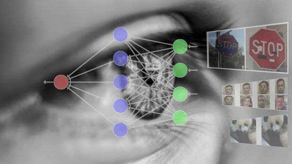

## Multi-defense framework against adversarial attacks on deep learning medical imaging models

### Introduction:
Deep learning has transformed medical imaging by enabling automated disease detection with accuracy that rivals, and sometimes exceeds, human experts. However, the clinical reliability of these models is severely compromised by their susceptibility to adversarial attacks—subtle, imperceptible perturbations that can cause critical misclassifications. In high-stakes domains like healthcare, where diagnostic accuracy directly affects patient outcomes, such vulnerabilities pose serious risks to safety and trust.

Adversarial attacks on medical imaging pose a significant threat to the reliability of deep learning models for medical imaging. These attacks exploit vulnerabilities in these models by manipulating input data, leading to misclassifications and incorrect diagnoses. Building and evaluating deep learning models that are very robust to complex adversarial attacks (like Carlini-Wagner, DeepFool and PGD) will improve medical diagnosis and increase the generalizability of existing defense strategies.

### Requirements
- Python 3.8+

- PyTorch

- Torchvision

- Foolbox

- Matplotlib

- NumPy